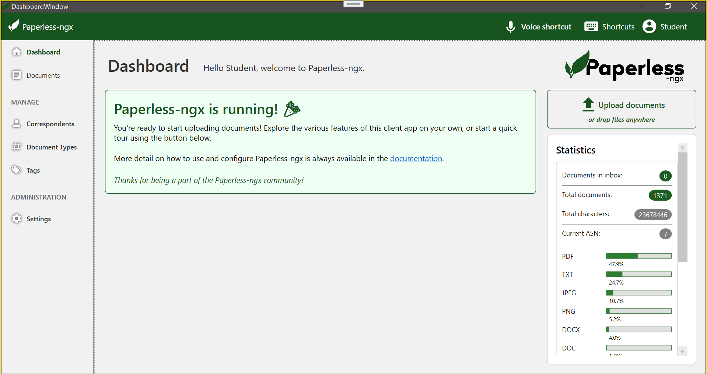

# Paperless-ngx Desktop Client

Unofficial Windows desktop client for Paperless-ngx built using REST API and WPF (.NET).

## 📌 Overview

This application provides a native Windows experience for managing documents in Paperless-ngx.
The UI is inspired by the official web interface but adapted for desktop usability.

## ✨ Features

- Dashboard overview with statistics
- Document upload support
- Document browsing and filtering
- Tags and classification system
- Integration with Paperless-ngx REST API
- Responsive desktop UI

## 🖥️ UI Preview

## 🧠 Motivation

The goal of this project was to explore Human-Computer Interaction principles by improving usability of an existing web system and translating it into a desktop environment.

## ⚙️ Tech Stack

- C#
- .NET (WPF)
- REST API
- MVVM pattern

## 📄 HCI Analysis

See `docs/HCI_Analiza_Srdan_Pesevic.pdf` for detailed analysis of UI/UX improvements compared to the web version.

## 🚀 Status

This is an educational project and an unofficial client for Paperless-ngx.
